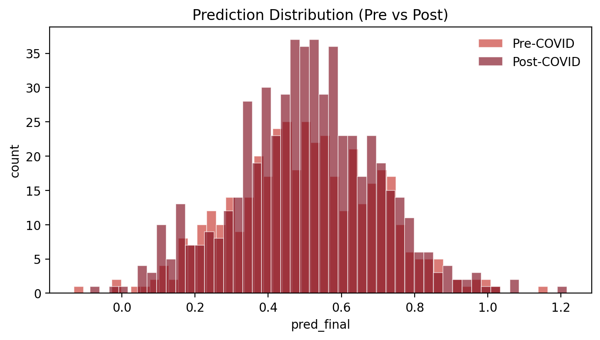
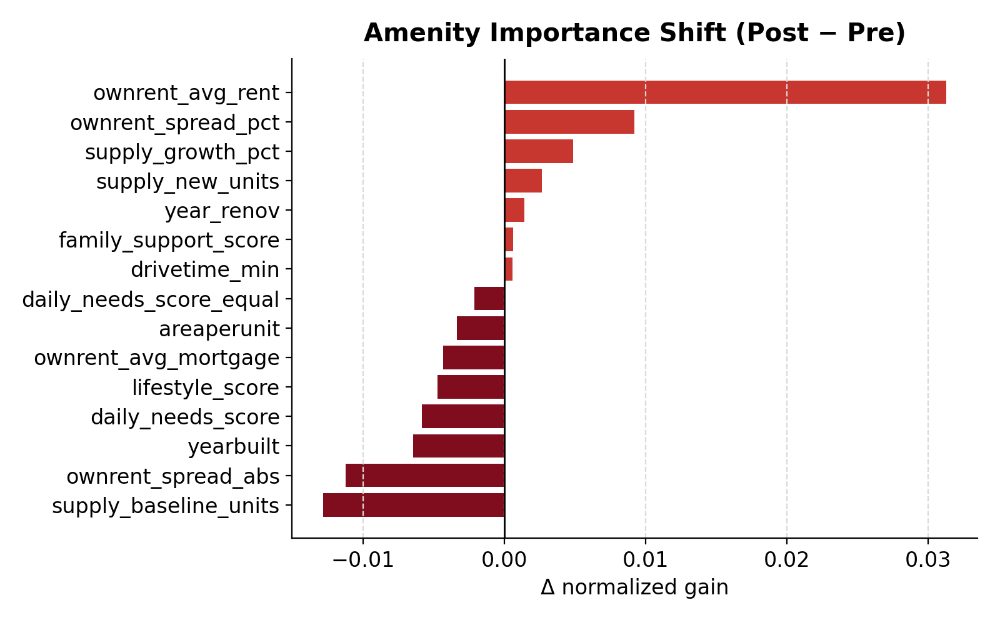
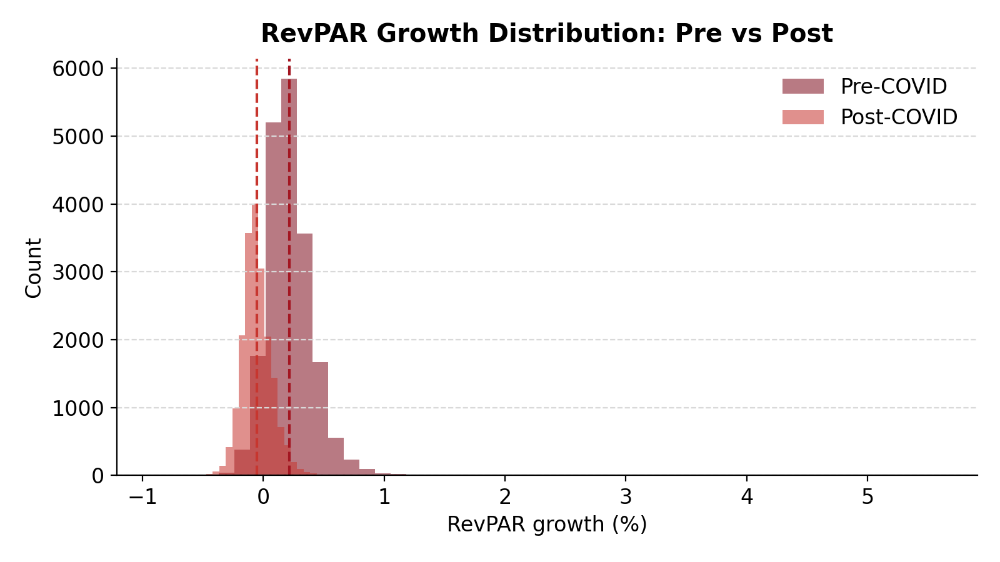
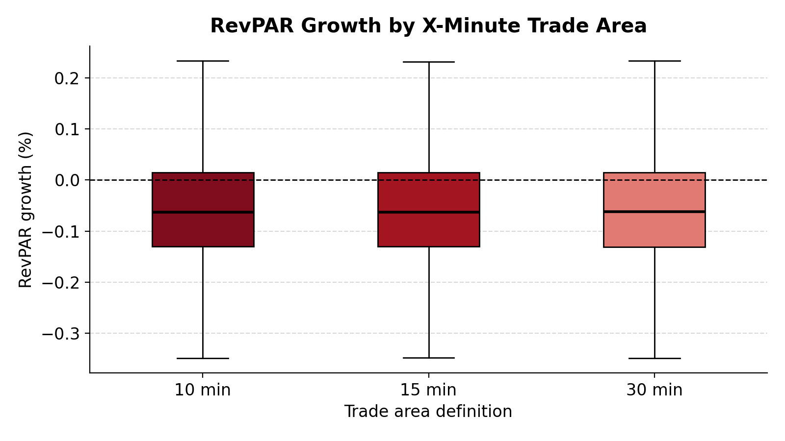

# 2026 Rice Datathon — Redefining “Local” in the X-Minute City

This repository contains our end-to-end, deterministic pipeline for:
1) predicting RevPAR growth (RMSE metric), and  
2) extracting interpretable evidence on how the drivers of outperformance shift **pre-COVID vs post-COVID** under different notions of “local”.

> **Data confidentiality notice (competition rule):**  
> The datasets are provided for competition use only. Do **not** upload raw data to public repos.  
> After the event, delete all local copies per the organizers’ policy.

---

## Problem Summary

Apartments are a key part of US housing. We predict **RevPAR growth** and study whether renter preferences and “local” neighborhood advantage changed after COVID.

**Key challenge:** the dataset is a *panel* where each row corresponds to a property observed under a specific **time window** (pre/post) and (when available) a **drivetime trade area** (10/15/30 minutes). The same property appears multiple times, so evaluation must avoid row-level leakage.

---

## Repository Structure

<pre>
RiceDatathon_2026_Finance/
├── Data/
│   ├── Raw/                  # Confidential organizer-provided data (DO NOT COMMIT)
│   └── Processed/            # Deterministic derived tables and model inputs
├── Notebooks/                # Feature engineering, modeling, and analysis notebooks
├── Outputs/
│   ├── Figures/              # Saved plots used in analysis and presentation
│   └── Submissions/          # Final submission CSV files
└── README.md                 # Project overview, methodology, results, and reproducibility
</pre>

---

## Key Generated Artifacts

### Processed Data
- `panel_with_amenity_scores.csv`  
  - Property × time_window × drivetime panel  
  - **38,941 rows**

- `scoring_with_amenity_scores.csv`  
  - Scoring set with engineered features  
  - **8,997 rows × 123 columns**

- `train_with_oof_pred.csv`  
  - Training data with out-of-fold predictions (error analysis)

### Model Outputs
- `importance_shift_post_minus_pre.csv`  
  - Normalized gain importance shift (post − pre)

- `dual_model_importance_shift.csv`  
  - Separate pre/post model importance comparison

### Figures
Saved under `Outputs/Figures/`, including:
- `pred_distribution_all.png`
- `pred_distribution_pre_vs_post.png`
- `fig_importance_shift_post_minus_pre_top15.png`
- `fig_binned_daily_needs_vs_target.png`

### Submissions
- `submission_final_<timestamp>.csv`

---

## Feature Engineering (Domain-Aware & Interpretable)

Rather than using raw amenity counts directly, we construct **behaviorally meaningful access indices**.

### Daily Needs Score (Ring-Normalized)
Daily-use amenities are standardized **within each drivetime ring** to measure *relative accessibility at the same travel-time scale*.

Weighted index:
| Amenity | Weight |
|-------|--------|
| Grocery | 0.30 |
| Food | 0.30 |
| Childcare | 0.20 |
| Pharmacy | 0.20 |

Variants:
- `daily_needs_score_equal` — equal-weight mean  
- `daily_needs_score` — weighted index

### Lifestyle & Family Support Scores
- `lifestyle_score` — sum of lifestyle-oriented amenities  
- `family_support_score` — sum of family-support amenities  

These are intentionally **simple and transparent** for interpretability.

All engineered features are deterministic and saved to disk.

---

## Modeling Approach

### Validation Strategy (Critical Design Choice)
Because properties repeat across rows, we evaluate models using:

**GroupKFold cross-validation grouped by property ID**

This prevents leakage where the same property appears in both training and validation folds.

---

## Model Performance

### Baseline Pooled Model (16 features)
5-fold GroupKFold CV:
- Fold RMSEs:  
  `0.111, 0.129, 0.126, 0.114, 0.144`
- **Mean RMSE: 0.12481**
- **Std: 0.01158**

### Candidate Hyperparameter Sweep
Small, controlled search (not over-tuned).

Best candidate:
- `num_leaves=63`
- `min_child_samples=30`
- `subsample=0.85`
- `colsample_bytree=0.85`
- `reg_lambda=1.0`

Performance:
- **RMSE mean: 0.12417**
- **RMSE std: 0.00468**

---

## Window-Specific Models (Pre vs Post)

To explicitly capture structural change, we trained **separate models** for:

- `pre` (2015–2020)
- `post` (2022–2025)

Enhancements:
- Group-safe **target encoding** for categorical market features
- Feature intersection to ensure scoring compatibility

### Feature Count
- **105 features** after encoding and intersection

> Note: `drivetime_min` was excluded in the TE pipeline because it was unavailable in scoring.  
> This limitation is reported explicitly to avoid over-interpretation.

### Post-Only Model (GroupKFold CV)
- **RMSE mean: 0.03577**
- **RMSE std: 0.00634**
- Median best iteration ≈ 1823 (early stopping)

---
## Key Findings: Visual Evidence

### Prediction Distribution: Pre vs Post

Comparing pre-COVID and post-COVID prediction distributions reveals a clear shift in both location and spread.
This suggests a structural change in the drivers of RevPAR growth rather than a simple rescaling of the same relationships.

### Amenity Importance Shift (Post − Pre)

Normalized gain differences between post-COVID and pre-COVID models highlight which features became more or less predictive after COVID.
Positive values indicate increased importance post-COVID, while negative values indicate declining relevance.

### RevPAR Growth Distribution: Pre vs Post

The realized RevPAR growth distribution mirrors the prediction shift, confirming that post-COVID performance changes are not an artifact of modeling but reflect underlying outcome differences.

### RevPAR Growth by X-Minute Trade Area

RevPAR growth distributions across 10-, 15-, and 30-minute trade areas show consistent medians but increasing dispersion at larger radii.
This supports the interpretation that “local” effects operate differently across spatial definitions, particularly in the post-COVID period.

## Key Findings: What Changed Post-COVID?

From normalized gain importance (post − pre):

Largest increases:
- `numunits` **(+0.0699)**
- `areaperunit`
- `ownrent_spread_pct`
- `ownrent_avg_rent`
- `supply_growth_pct`
- `lifestyle_score`
- `family_support_score`

Stable baseline:
- `daily_needs_score` (≈ 0 change)

### Interpretation (Associational)
- Post-COVID outperformance is increasingly tied to:
  - **asset scale and positioning**
  - **local pricing dynamics**
  - **housing supply growth**
  - **lifestyle & family-support accessibility**
- Daily-needs access remains necessary but does **not** explain the reshuffling of top performers.

---

## Limitations

- Amenity features capture **availability, not quality or congestion**.
- Remote-work behavior and commuting patterns are not directly observed.
- Results are **predictive and associational**, not causal.

## Reproducibility

### Environment

Install the required Python packages:
	•	pandas
	•	numpy
	•	scikit-learn
	•	lightgbm
	•	matplotlib

### Workflow
	1.	Place the confidential input data in the Data/Raw/ directory.
	2.	Run the feature engineering steps to generate derived tables in Data/Processed/.
	3.	Train the models using property-grouped cross-validation (GroupKFold) to avoid leakage across repeated property observations.
	4.	Generate analysis figures and the final submission CSV files.

All steps in this pipeline are deterministic and fully reproducible.

---

## One-Sentence Takeaway

Post-COVID RevPAR outperformance is driven less by simple proximity and more by asset scale, pricing structure, supply dynamics, and lifestyle-oriented neighborhood access, while daily-needs access remains a stable baseline rather than the primary differentiator.
